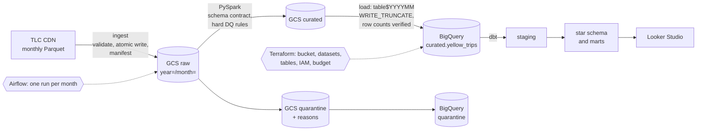

# NYC Taxi Lakehouse

An end-to-end lakehouse and ELT platform on NYC TLC yellow taxi trips: 218 million rows for
2019–2023, with 2024 arriving month by month. Raw Parquet lands in Google Cloud Storage, PySpark
enforces a schema contract and data-quality rules, BigQuery holds the warehouse, dbt models it
into a star schema, and Airflow will run it one month at a time.

The point is not the tool count. Every stage can be re-run without double-counting, every
rejected row is kept with its reasons, and every cost decision is written down.

## Architecture



## What the data-quality rules caught

Real runs on two months. Every source row is accounted for, and the job fails if it is not.

| Month | Source rows | Curated | Quarantined | Largest reason |
|-------|------------:|--------:|------------:|----------------|
| 2019-01 | 7,696,617 | 7,682,131 | 14,486 (0.19%) | Refund/void reversal pairs |
| 2024-06 | 3,539,193 | 3,434,764 | 104,429 (2.95%) | Refund/void reversal pairs |

Most negative fares are not junk. They exactly cancel an earlier charge for the same trip, so both
halves are quarantined and revenue nets to what was collected. The full rule set, thresholds, and
reasoning are in [docs/data_quality_rules.md](docs/data_quality_rules.md).

## Decisions worth reading

- **Idempotency by construction.** Lake keys are pure functions of the month. BigQuery loads swap
  exactly one month partition. The Spark job's DQ report is a commit marker, so a crashed run can't be loaded.
- **Schema drift is a contract.** Types change between files in 2023. A single canonical schema
  absorbs known variants, and any unknown column fails the month.
- **Time zones.** Source timestamps are NYC wall-clock with no zone, and every layer preserves that.
- **Cost.** Month partitions, physical storage billing, dropping a 16.7 GiB redundant column, and
  per-query byte caps in dbt.

All of it, with evidence, is in [docs/design.md](docs/design.md).

## Status

| Phase | Scope | State |
|-------|-------|-------|
| 0 | One month end to end | Done. 2024-06 verified on GCP: lake, Spark, BigQuery, dbt |
| 1 | Multi-year partitioned ingest | Next: backfill 2019-2023 |
| 2 | Spark cleaning and DQ rules | Hard rules done; soft flags and speed rule pending |
| 3 | dbt star schema, marts, tests, docs | Staging model and daily mart done |
| 4 | Airflow, incremental and idempotent | Designed |
| 5 | CI with dbt tests; cost tuning | Designed |
| 6 | Dashboard and write-up | Not started |

## Quickstart

Local, no cloud account needed:

```bash
uv sync
uv run pytest
uv run python -m lakehouse.ingest --month 2024-06
uv run python -m lakehouse.transform --month 2024-06
cat data/lake/reports/yellow/year=2024/month=06/dq_report.json
```

On GCP. Everywhere below, use the project **ID**, not its display name: the console appends
digits to the ID when a name is taken, and the wrong value fails with a confusing
`serviceusage.services.use` permission error. `gcloud projects list` shows both.

```bash
gcloud auth application-default login
```

```bash
gcloud auth application-default set-quota-project YOUR_PROJECT_ID
```

One API has to be enabled by hand before the first apply. Terraform reads project metadata to
build the budget, and that read needs the very API Terraform would otherwise enable itself:

```bash
gcloud services enable cloudresourcemanager.googleapis.com --project=YOUR_PROJECT_ID
```

Then fill `infra/terraform.tfvars` from the example file and apply. It creates 14 resources:
the bucket, the dataset and its two tables, the pipeline service account and its roles, the
enabled APIs, and a budget alert.

```bash
terraform -chdir=infra apply
```

```bash
GCP_PROJECT_ID=YOUR_PROJECT_ID scripts/run_slice.sh 2024-06
```

## Layout

```
src/lakehouse/    ingest, schema contract, quality rules, Spark transform, BigQuery load
schemas/bigquery/ warehouse table contracts, shared by Terraform, the loader, and tests
dbt/              staging models, marts, tests
infra/            Terraform: bucket, datasets, tables, service account, budget alert
scripts/          source-schema survey, profiling, one-month slice runner
docs/             design decisions and data-quality rules
tests/            unit tests, including real-era Parquet fixtures
```
