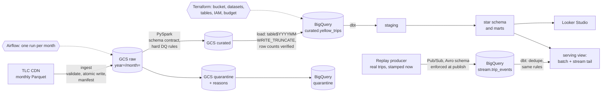

# NYC Taxi Lakehouse

**[View the dashboard](https://claude.ai/artifact/VmEzbAN9mvGXU38v7NiKwc)**: six years of trips, from the 2020 collapse to rising fares,
built from this pipeline's reporting marts.

An end-to-end lakehouse and ELT platform on NYC TLC yellow taxi trips: 256 million rows across
2019 to 2024. Raw Parquet lands in Google Cloud Storage, PySpark
enforces a schema contract and data-quality rules, BigQuery holds the warehouse, dbt models it
into a star schema, and Airflow runs it one month at a time. A second, streaming path carries
trips through Pub/Sub into the same warehouse as they happen.

The point is not the tool count. Every stage can be re-run without double-counting, every
rejected row is kept with its reasons, and every cost decision is written down.

## Architecture



## What the data-quality rules caught

All 72 months, 2019 through 2024, processed under the final rule set in 189 minutes with no
failures. Every source row is accounted for, and the job fails if it is not.

| Scope | Source rows | Curated | Quarantined |
|-------|------------:|--------:|------------:|
| 2019-2024 | 259,287,888 | 255,733,484 | 3,554,404 (1.37%) |

Most negative fares are not junk. They exactly cancel an earlier charge for the same trip, so both
halves are quarantined and revenue nets to what was collected. The full rule set, thresholds, and
reasoning are in [docs/data_quality_rules.md](docs/data_quality_rules.md).

## What six years of trips show

| Year | Trips | Revenue | Avg fare | Tips as share of fares |
|------|------:|--------:|---------:|-----------------------:|
| 2019 | 84,183,201 | $1.62B | $19.19 | 16.4% |
| 2020 | 24,412,937 | $0.45B | $18.37 | 16.6% |
| 2021 | 30,551,965 | $0.60B | $19.78 | 17.5% |
| 2022 | 39,116,941 | $0.86B | $21.90 | 18.6% |
| 2023 | 37,575,606 | $1.09B | $29.01 | 18.0% |
| 2024 | 39,892,834 | $1.15B | $28.74 | 17.1% |

- **April 2020 was the floor.** 235,266 trips, against 7,446,270 in April 2019. A 97% collapse.
- **Ridership never came back, but revenue mostly did.** 2024 carried 47% of 2019's trips and took
  71% of its revenue, because the average fare rose by half.
- **Airports carry more of the business.** Airport pickups grew from 5.8% of all trips in 2019 to
  7.8% in 2024, recovering faster than street hails.
- **The business is Manhattan.** Manhattan-to-Manhattan trips are 84% of the six-year total.

The tip column counts tips against fares across all trips. The TLC records tips automatically for
card payments and never records cash tips, so treat it as a floor rather than a tipping rate.

## Dashboard

**[NYC Yellow Taxi, 2019–2024](https://claude.ai/artifact/VmEzbAN9mvGXU38v7NiKwc)** presents this data: the 2020 collapse, fares, demand
by hour, airports, and borough corridors, with data through December 2024. Its figures are a
published snapshot of the reporting marts, so viewing it never queries the warehouse.

Five reporting views feed the BI layer, each denormalized so charts need no joins: daily
overview, hourly profile, borough flows, zone flows, and airport traffic.

A dashboard that queries BigQuery live runs a query for every visitor, on the owner's bill. Four
of the five views are small on purpose, so a BI tool can serve them from cached extracts at no
cost. Only the 1.6 million-row zone detail needs a live connection.

| View | Rows |
|------|-----:|
| Daily overview | 2,192 |
| Hourly profile | 44,539 |
| Borough flows | 2,355 |
| Airport traffic | 366 |
| Zone flows | 1.6 million |

## Decisions worth reading

- **Idempotency by construction.** Lake keys are pure functions of the month. BigQuery loads swap
  exactly one month partition. The Spark job's DQ report is a commit marker, so a crashed run can't be loaded.
- **Schema drift is a contract.** Types change between files in 2023. A single canonical schema
  absorbs known variants, and any unknown column fails the month.
- **Time zones.** Source timestamps are NYC wall-clock with no zone, and every layer preserves that.
- **Cost.** Month partitions, physical storage billing, dropping a 16.7 GiB redundant column, and
  per-query byte caps in dbt.
- **CI that can actually fail the build.** Every pull request runs the tests and a real dbt build
  against BigQuery, authenticated without any stored key, in a dataset it creates and drops.
- **Streaming without a streaming cluster.** Pub/Sub writes straight into BigQuery through a
  BigQuery subscription, with the schema enforced at publish time. Staging deduplicates the
  at-least-once deliveries and applies the batch rules in SQL, and a serving view joins batch
  history to the stream tail. Nothing runs, and nothing bills, unless events flow.
- **A star schema that can fail.** Dimensions come from seeds transcribed from the TLC dictionary,
  never from `select distinct` over the facts, so relationship tests catch a code the data invents.
  The fact is incremental by month, so a routine build scans one month, not 219 million rows.

All of it, with evidence, is in [docs/design.md](docs/design.md).

## Status

| Phase | Scope | State |
|-------|-------|-------|
| 0 | One month end to end | Done. 2024-06 verified on GCP: lake, Spark, BigQuery, dbt |
| 1 | Multi-year partitioned ingest | Done. 60 months, 218M rows, 58 GiB in BigQuery |
| 2 | Spark cleaning and DQ rules | Done. 13 hard rules, 4 soft flags, all 72 months reprocessed |
| 3 | dbt star schema, marts, tests, docs | Done. 5 dimensions, incremental fact, 4 marts, 56 tests |
| 4 | Airflow, incremental and idempotent | Done. 6 months run through the DAG; re-runs replace |
| 5 | CI with dbt tests; cost tuning | Done. Keyless auth, one-month build, 2.74 GiB per run |
| Stretch | Streaming path | Done. Pub/Sub into BigQuery, dedupe and rules in dbt, lambda view |
| 6 | Dashboard and write-up | [Dashboard published](https://claude.ai/artifact/VmEzbAN9mvGXU38v7NiKwc); Looker Studio report in progress |

## Quickstart

Local, no cloud account needed:

```bash
uv sync
uv run pytest
uv run python -m lakehouse.ingest --month 2024-06
uv run python -m lakehouse.transform --month 2024-06
cat data/lake/reports/yellow/year=2024/month=06/dq_report.json
```

On GCP. Everywhere below, use the project **ID**, not its display name: the console appends
digits to the ID when a name is taken, and the wrong value fails with a confusing
`serviceusage.services.use` permission error. `gcloud projects list` shows both.

```bash
gcloud auth application-default login
```

```bash
gcloud auth application-default set-quota-project YOUR_PROJECT_ID
```

One API has to be enabled by hand before the first apply. Terraform reads project metadata to
build the budget, and that read needs the very API Terraform would otherwise enable itself:

```bash
gcloud services enable cloudresourcemanager.googleapis.com --project=YOUR_PROJECT_ID
```

Then fill `infra/terraform.tfvars` from the example file and apply. It creates 14 resources:
the bucket, the dataset and its two tables, the pipeline service account and its roles, the
enabled APIs, and a budget alert.

```bash
terraform -chdir=infra apply
```

```bash
GCP_PROJECT_ID=YOUR_PROJECT_ID scripts/run_slice.sh 2024-06
```

Replay twenty minutes of a real Friday rush hour as a live feed, with 2% deliberate faults:

```bash
uv run python -m lakehouse.stream_replay --month 2024-06 --day 2024-06-14 --start 17:00 --minutes 20 --speedup 20 --fault-rate 0.02
```

Browse the models, tests, and lineage graph:

```bash
cd dbt && uv run dbt docs generate --profiles-dir . && uv run dbt docs serve --profiles-dir .
```

## Layout

```
src/lakehouse/    ingest, schema contract, quality rules, Spark transform, BigQuery load,
                  backfill runner, stream replay producer
schemas/          BigQuery table contracts and the Pub/Sub event schema, shared by Terraform
                  and tests
dbt/              seeds, staging, star schema (core), reporting marts, tests
infra/            Terraform: bucket, datasets, tables, service account, budget alert
orchestration/    Airflow image, compose file, and the monthly DAG
scripts/          source-schema survey, profiling, one-month slice runner
.github/          CI workflow: lint, tests, and a real dbt build per pull request
docs/             design decisions and data-quality rules
tests/            unit tests, including real-era Parquet fixtures
```
