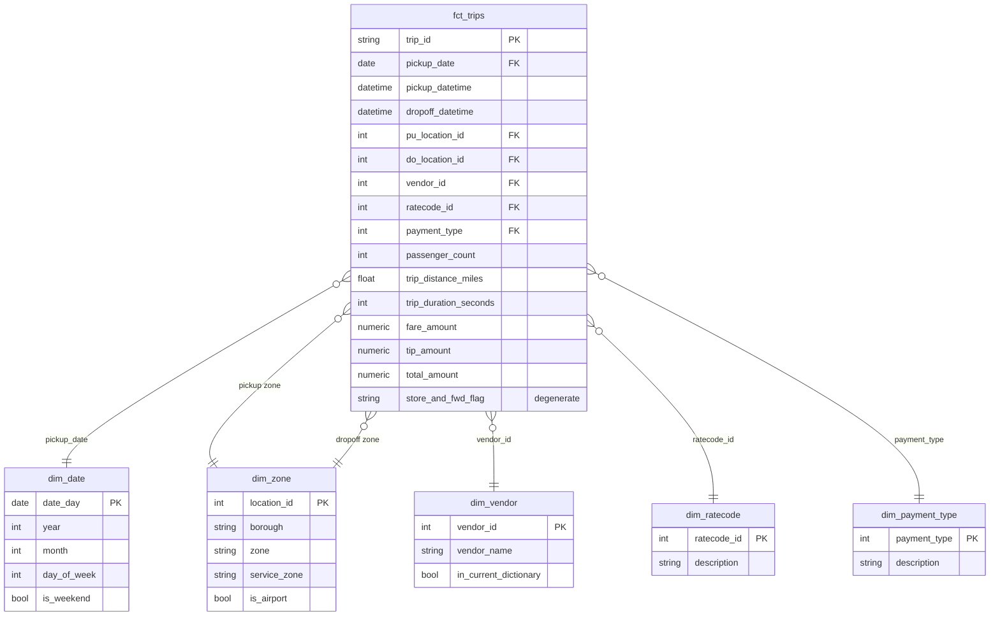

# Design

This document records the decisions behind the pipeline and the evidence each rests on.
Numbers come from the profiling scripts in `scripts/` and from the Spark job's own
data-quality reports on real months.

## 1. Principles

- **Depth over breadth.** The core stack, built so it could run production data: incremental,
  idempotent, tested, documented, and cost-aware.
- **Every stage is idempotent.** Re-running any month replaces that month. Nothing appends.
- **Nothing is dropped silently.** Rejected rows are kept with the reasons they failed.
- **Cost is designed in.** Partitioning, billing models, and query caps are decided up front.

## 2. Scope

| Slice | Months | Rows | Raw Parquet |
|-------|--------|-----:|------------:|
| Backfill | 2019-01 → 2023-12 | 218,118,168 | 3.35 GB |
| Incremental demo | 2024-01 → 2024-12 | 41,169,720 | 0.69 GB |

Yellow taxi only. Green taxi would add a second schema to harmonize without new engineering signal.

## 3. Responsibilities and idempotency

| Stage | Code | Owns | How a re-run stays correct |
|-------|------|------|----------------------------|
| Ingest | `lakehouse.ingest` | Download one month; land it unmodified in the raw zone | Key is a pure function of the month. Validated before upload, written atomically, manifest written last |
| Transform | `lakehouse.transform` (PySpark) | Schema contract, hard DQ rules, dedup, quarantine | Overwrites only its month's directories. DQ report deleted first, written last, after reconciliation |
| Load | `lakehouse.load` | Curated and quarantine Parquet into BigQuery | Partition decorator (`table$YYYYMM`) with `WRITE_TRUNCATE`; loaded row count must equal the DQ report |
| Model | dbt | Business logic, star schema, marts, tests | Pure SQL over loaded partitions |
| Orchestrate | Airflow (Phase 4) | One DAG run per month | Each run touches only its own month |
| Infrastructure | Terraform | Bucket, datasets, tables, service account, budget | Declarative |

**Spark vs dbt.** Spark owns anything that would otherwise rescan hundreds of millions of rows on
every dbt run: type coercion, hard rules, deduplication, and reversal pairing. dbt owns business
meaning: renames, dimensions, facts, marts, and tests that gate the build.

## 4. Lake layout

```
gs://<project>-lake/
  raw/yellow/year=YYYY/month=MM/yellow_tripdata_YYYY-MM.parquet   # byte-for-byte from TLC
  raw/yellow/year=YYYY/month=MM/_manifest.json                     # url, ETag, sha256, rows
  curated/yellow/year=YYYY/month=MM/part-*.parquet                 # passed every hard rule
  quarantine/yellow/year=YYYY/month=MM/part-*.parquet              # failed, with reasons
  reports/yellow/year=YYYY/month=MM/dq_report.json                 # counts; the commit marker
```

## 5. Source schema drift and the canonical contract

A footer-only survey of all 72 files for 2019–2024 (`scripts/survey_source_schemas.py`) found:

| Source column | 2019-01 → 2023-01 | 2023-02 → 2024-12 |
|---------------|-------------------|-------------------|
| `VendorID`, `PULocationID`, `DOLocationID` | int64 | int32 |
| `passenger_count`, `RatecodeID` | double | int64 |
| `store_and_fwd_flag` | string | large_string |
| airport fee | `airport_fee`: null-typed in 20 files through 2020-10, then double | `Airport_fee` (capitalized) double |
| `cbd_congestion_fee` | absent | absent (added in 2025) |
| pickup / dropoff | `timestamp[us]`, `isAdjustedToUTC=false` | same |
| monetary columns | double | double |

Canonical decisions (`src/lakehouse/schema.py`, `schemas/bigquery/*.json`):

| Column(s) | Canonical | Rule |
|-----------|-----------|------|
| vendor, zone, rate code, payment IDs | INT64 | BigQuery has one integer type; widening int32 loses nothing |
| `passenger_count` | INT64 | NULL stays NULL. A 0 would raise the 2024-06 zero-passenger share from 1.0% to 12.6% |
| `ratecode_id` | INT64 | NULL → 99, the TLC dictionary's own "Null/unknown" code |
| `congestion_surcharge`, `airport_fee`, `cbd_congestion_fee` | NUMERIC | NULL or absent → 0 |
| all monetary columns | DECIMAL(10,2) → NUMERIC | Exact sums. Largest observed amount, 623,261.66, fits. Spark 4 ANSI casts fail loudly on overflow |
| `trip_id` | STRING | MD5 of every canonical column **before** fills, so a filled NULL never collides with a real 0 |

Unknown or missing source columns raise `SchemaContractError` and fail the month. A new column
is a contract change for a human to review, not something to drop silently.

**What the NULLs really are.** NULL `passenger_count` rows always also have NULL rate code,
NULL store-and-forward flag, NULL congestion surcharge, and payment type 0. They are one class of
record submitted without meter attributes, and their share is growing:

| Month | NULL passenger_count | Recorded zero passengers |
|-------|---------------------:|-------------------------:|
| 2019-01 | 28,672 (0.4%) | 117,381 |
| 2021-01 | 98,352 (7.2%) | 26,726 |
| 2023-01 | 71,743 (2.3%) | 51,164 |
| 2024-06 | 410,781 (11.6%) | 35,839 |

Because of that growth, `passenger_count` is never filled. SQL aggregates already skip NULLs, so
the one rule is to divide passenger sums by `trips_with_recorded_passengers`, never by all trips.
The daily mart exposes that denominator and a dbt test checks it never exceeds total trips.

## 6. Time

TLC timestamps are NYC local wall-clock time with no zone. Every layer preserves that:

1. Spark reads them as `TIMESTAMP_NTZ` and the session time zone is pinned to UTC.
2. Spark writes Parquet `TIMESTAMP(isAdjustedToUTC=false)` as INT64 microseconds.
3. BigQuery's Parquet conversion loads every timestamp as `TIMESTAMP`, so the wall-clock value
   arrives labeled UTC. Month partitions still align with local months, because the label is the
   wall clock.
4. dbt staging recovers the wall-clock value losslessly with `DATETIME(ts, 'UTC')`.

Two consequences are documented rather than hidden:

- Filters that should prune partitions must use `pickup_partition_ts`, the raw column. A filter on
  an expression over it does not prune.
- A trip that crosses a daylight-saving change has a duration one hour off. The source carries no
  zone, so this cannot be corrected.

## 7. Data quality

See [data_quality_rules.md](data_quality_rules.md) for every rule, its rationale, and what it
caught on real months.

## 8. Dimensional model

**Grain: one row per completed trip** (a curated row). Reversal pairs and other rejected rows
live in the quarantine table, outside the star.



- **`dim_zone`** is seeded from the TLC zone lookup CSV and plays two roles, pickup and dropoff.
  `is_airport` marks Newark, JFK, and LaGuardia.
- **`dim_vendor`, `dim_ratecode`, `dim_payment_type`** are dbt seeds transcribed from the TLC data
  dictionary (March 2025). Vendor codes 4 and 5 appear in 2019 data but not in the current
  dictionary, so `in_current_dictionary` records that rather than inventing names.
- **`dim_date`** is generated, one row per calendar day in scope.
- Planned marts: daily metrics (built in Phase 0), hourly demand, card-only tip analysis,
  zone-to-zone flows, and airport trips.

## 9. Warehouse layout and cost

**Tables** (Terraform, `infra/main.tf`):

| Table | Partitioning | Clustering |
|-------|--------------|------------|
| `curated.yellow_trips` | MONTH on `pickup_datetime` | `pu_location_id`, `do_location_id` |
| `curated.yellow_trips_quarantine` | MONTH on `source_month` | `reject_reason` |

MONTH rather than DAY because the unit of work is a month. One decorator swaps one partition
atomically; DAY partitioning would need about 30 decorator loads per month or a MERGE. The
quarantine table partitions by source month because out-of-period rows must still land in the
partition of the file that produced them.

**Storage.** Logical bytes are fixed by column type (INT64 8 bytes, NUMERIC 16, STRING 2 plus
length), about 286 bytes per curated row:

| Scope | Logical size |
|-------|-------------:|
| 2019–2023 backfill | 58.1 GiB |
| Including 2024 | 69.1 GiB |

The first real load measured 284 bytes per row, within 1% of this estimate.

A per-row `source_file` URI was dropped from the warehouse: it would have added 16.7 GiB to repeat
what `source_month` already encodes. It stays in the DQ report.

List prices checked 2026-09-11, identical for us-central1 and the US multi-region: active logical storage is about $0.023 per GiB-month
and active physical about $0.040, each with 10 GiB free per month. At 58 GiB, logical billing
costs roughly $1.10 a month. The curated dataset uses **physical** billing instead, because
columnar compression should put compressed bytes near the free tier. Physical billing also charges
for time-travel bytes, so the window is set to its 48-hour minimum. This estimate is verified with
`INFORMATION_SCHEMA.TABLE_STORAGE` after the backfill; the billing model can change only every 14 days.

**What the compressed bytes are made of.** Measured on curated 2019-01 Parquet, as a rough proxy
for BigQuery's own compression:

| Column | Compressed | Share | Compression |
|--------|-----------:|------:|------------:|
| All columns | 416 MB (54 bytes/row) | 100% | |
| `trip_id` | 232 MB | 56% | 1.2x |
| `pickup_datetime` | 56 MB | 13% | 1.1x |
| `dropoff_datetime` | 56 MB | 13% | 1.1x |

At 54 bytes per row the backfill is roughly 11 GiB compressed, just above the free tier. An MD5 hex
string is random, so `trip_id` barely compresses. The timestamps compress poorly because the window
shuffles scramble time order. Two Phase 5 candidates would shrink this: sort each month's output by
pickup time before writing, and store `trip_id` as 16 raw bytes instead of 32 hex characters.

**Queries.** On-demand queries cost $6.25 per TiB after 1 TiB free each month. Guardrails:

- dbt profiles set `maximum_bytes_billed` (20 GB dev, 5 GB CI), so a runaway query fails instead of billing.
- CI builds against a single month.
- Estimated full scans over the backfill: the daily mart about 16.5 GiB, the `unique(trip_id)` test about
  6.9 GiB. Phase 3 makes the fact table and marts incremental so routine builds scan only new months.

**Region.** The bucket and datasets both live in us-central1. BigQuery load jobs need the bucket
and dataset colocated, and only regional US buckets qualify for the Cloud Storage free tier;
the US multi-region does not.

**Lake.** Soft delete is disabled on the bucket: every write is an idempotent overwrite and raw files can
be re-downloaded, so retained copies would only add cost. Local Spark reading from GCS pays internet
egress on a few GB for a full backfill; running the same job on Dataproc in-region would remove it.

## 10. Orchestration plan (Phase 4)

- One DAG run per month, keyed on the run's data interval. Catchup from 2019-01 is the backfill.
- TLC publishes roughly two months late, and its CDN answers HTTP 403 until a file exists. The first
  task is a sensor in reschedule mode that polls with a HEAD request, so runs proceed at the pace TLC publishes.
- Each manifest stores the source ETag and Last-Modified. A changed value means TLC republished a
  month, which can be reprocessed safely because every stage is idempotent.

## 11. Verification status

Verified locally:

- 53 unit tests covering the schema contract, every rule, reversal pairing, dedup, reconciliation,
  re-run idempotency, the stale-report guard, ingest failure modes, the load job configuration, and
  the Parquet types the loader depends on.
- Real ingest of 2019-01 and 2024-06, including an in-place re-run and an unpublished month.
- Real Spark runs on both months, reconciled exactly.

Verified on GCP on 2026-09-16, running 2024-06 end to end:

- Ingest wrote to the bucket, and Spark read and wrote `gs://` paths with Application Default Credentials.
- The decorator load wrote 3,434,764 curated and 104,429 quarantined rows into the `202406` partition,
  matching the data-quality report exactly.
- BigQuery stored the intended types: TIMESTAMP for wall-clock pickups, NUMERIC money, DATE source
  month, and REPEATED STRING reasons. Partitioning and clustering match the Terraform contract.
- The staging DATETIME range for the month runs 2024-06-01 00:00:00 to 2024-06-30 23:59:57, so no
  time zone shift crept in anywhere along the path.
- `dbt build` ran 1 view, 1 table, and 20 tests with no failures.
- Storage measured 284 logical bytes per row against the 286 predicted in section 9.

Two integration bugs this caught, both fixed:

- The 3.x Cloud Storage connector crashes on vectored Parquet reads against the Hadoop 3.4 that
  Spark 4.1 bundles. Pinned to 4.0.5.
- BigQuery rejects a load that sets both an explicit schema and decimal target types. The explicit
  schema is kept, since it already types money as NUMERIC.

Still unverified:

- Airflow orchestration and GitHub Actions CI, neither of which is built yet.
- The full backfill at scale. Only single months have run.
- Physical storage bytes, which need a project-level permission that the region storage view requires.
- The serving dashboard.

## 12. Known limitations

- Spark runs single-node (`local[*]`). The same job runs unchanged on Dataproc or EMR.
- Near-duplicates that differ only in surcharges are kept (see the rules doc).
- If the curated load succeeds and the quarantine load fails, the two tables disagree until the month is re-run.
- Great Expectations is deliberately not used: Spark quarantine plus dbt tests already cover data quality,
  and a third framework would add tooling without adding rigor.
